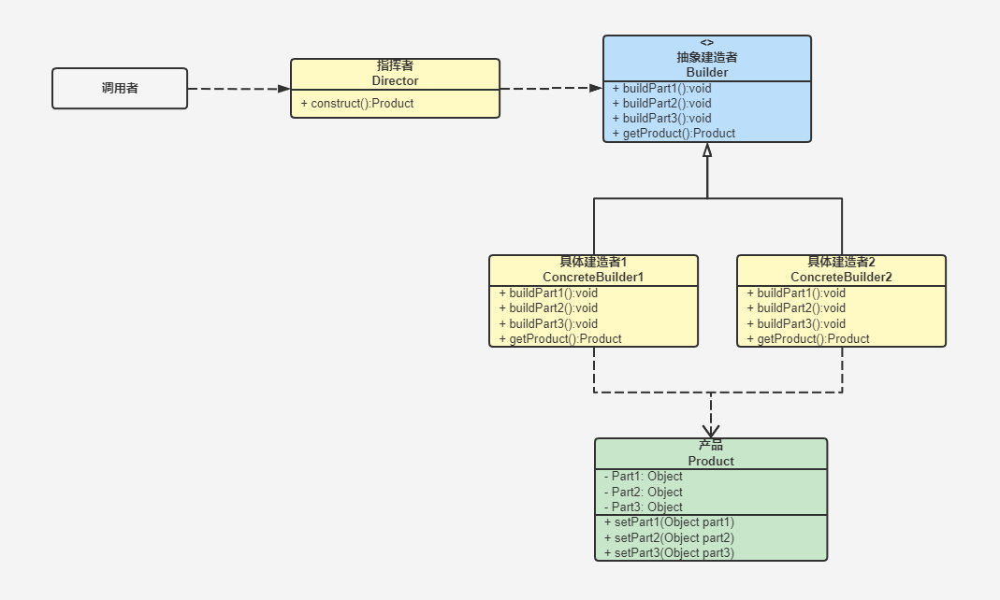

[TOC]

# 建造者模式

建造者模式又称生成器模式，是将一个复杂的对象的构建与它的表示分离，使得同样的构建过程可以创建不同的表示。
创建者模式隐藏了复杂对象的创建过程，它把复杂对象的创建过程加以抽象，通过子类继承或者重载的方式，动态的创建具有复合属性的对象。

**作用**

- 建造者独立，易扩展。具体建造者相互独立，方便扩展，符合开闭原则。
- 客户端不需要知道产品内部细节，将产品本身与产品创建过程解耦，使得相同的创建过程可以创建不同的产品对象。
- 可以更加精细地控制产品的创建过程，将复杂对象分门别类抽出不同的类别来，使得开发者可以更加方便地得到想要的产品。

**缺点**

- 产品必须有共同点，有一定的使用范围限制。建造者模式的产品的组件基本相同，如果产品的差异性较大，建造者模式就不适用了。
- 如果产品内部变化复杂，可能会导致需要定义很多具体建造者来实现这种变化。

**适用场景**

- 当一个类的构造函数参数过多（超过四个），并且有的参数可有可无，或者很多产品有默认值。
- 产品类非常复杂或者产品类因为调用顺序不同而产生不同作用。

## 类图



- 产品（Product）：描述一个由一系列部件组成较为复杂的对象。
- 抽象建造者（Builder）：描述具体建造者的公共接口，一般用来定义建造细节的方法，并不涉及具体的对象部件的创建。
- 具体建造者（ConcreteBuilder）：描述具体建造者，并实现抽象建造者公共接口。
- 指挥者（Director）：调用具体建造者来创建复杂对象（产品）的各个部分，并按照一定顺序（流程）来建造复杂对象。

## 代码表达

```java
// 产品角色
public class Product {
    private String buildA;
    private String buildB;
    private String buildC;

    public String getBuildA() {
        return buildA;
    }

    public void setBuildA(String buildA) {
        this.buildA = buildA;
    }

    public String getBuildB() {
        return buildB;
    }

    public void setBuildB(String buildB) {
        this.buildB = buildB;
    }

    public String getBuildC() {
        return buildC;
    }

    public void setBuildC(String buildC) {
        this.buildC = buildC;
    }

    @Override
    public String toString() {
        return "Product{" +
                "buildA='" + buildA + '\'' +
                ", buildB='" + buildB + '\'' +
                ", buildC='" + buildC + '\'' +
                '}';
    }
}
```

```java
// 抽象建造者
public abstract class Builder {
    public abstract void bulidA();

    public abstract void bulidB();

    public abstract void bulidC();

    public abstract Product getProduct();
}
```

```java
// 具体建造者A
public class ConcreteBuilderA extends Builder {
    private Product product;

    public ConcreteBuilderA() {
        this.product = new Product();
    }

    @Override
    public void bulidA() {
        product.setBuildA("ConcreteBuilderA-bulidA");
    }

    @Override
    public void bulidB() {
        product.setBuildB("ConcreteBuilderA-bulidB");
    }

    @Override
    public void bulidC() {
        product.setBuildC("ConcreteBuilderA-bulidC");
    }

    @Override
    public Product getProduct() {
        return product;
    }
}

// 具体建造者B
public class ConcreteBuilderB extends Builder {
    private Product product;

    public ConcreteBuilderB() {
        this.product = new Product();
    }

    @Override
    public void bulidA() {
        product.setBuildA("ConcreteBuilderB-bulidA");
    }

    @Override
    public void bulidB() {
        product.setBuildB("ConcreteBuilderB-bulidB");
    }

    @Override
    public void bulidC() {
        product.setBuildC("ConcreteBuilderB-bulidC");
    }

    @Override
    public Product getProduct() {
        return product;
    }
}
```

```java
// 指挥者
public class Director {
    // 负责控制产品对象的构建过程；使客户端与对象的构建过程隔离
    public Product create(Builder builder) {
        builder.bulidA();
        builder.bulidB();
        builder.bulidC();
        return builder.getProduct();
    }
}
```

客户端调用

```java
// 客户端调用
Director director = new Director();
ConcreteBuilderA builderA = new ConcreteBuilderA();
Product productA = director.create(builderA);
System.out.println(productA);
// 在客户端不知道对象的建造过程和细节的情况下就可以直接创建复杂的对象
ConcreteBuilderB builderB = new ConcreteBuilderB();
Product productB = director.create(builderB);
System.out.println(productB);
```

## 建造者模式-静态内部类方式

通过静态内部类方式实现零件无序装配化构建，使构建过程更灵活。
相比 Product-Builder-ConcreteBuilder-Director 方式，减少了指挥者，客户端可自由定义构建过程，生产出不同复杂产品。

### 非静态内部类方式

```java
// 产品角色
public class Product {
    private String buildA;
    private String buildB;
    private String buildC;

    public String getBuildA() {
        return buildA;
    }

    public void setBuildA(String buildA) {
        this.buildA = buildA;
    }

    public String getBuildB() {
        return buildB;
    }

    public void setBuildB(String buildB) {
        this.buildB = buildB;
    }

    public String getBuildC() {
        return buildC;
    }

    public void setBuildC(String buildC) {
        this.buildC = buildC;
    }

    @Override
    public String toString() {
        return "Product{" +
                "buildA='" + buildA + '\'' +
                ", buildB='" + buildB + '\'' +
                ", buildC='" + buildC + '\'' +
                '}';
    }
}

// 抽象建造者
public abstract class Builder {
    public abstract Builder bulidA(String mes);

    public abstract Builder bulidB(String mes);

    public abstract Builder bulidC(String mes);

    public abstract Product build();
}

// 具体建造者
public class ConcreteBuilder extends Builder {
    private Product product;

    public ConcreteBuilder() {
        this.product = new Product();
    }

    @Override
    public Builder bulidA(String mes) {
        product.setBuildA(mes);
        return this;
    }

    @Override
    public Builder bulidB(String mes) {
        product.setBuildB(mes);
        return this;
    }

    @Override
    public Builder bulidC(String mes) {
        product.setBuildC(mes);
        return this;
    }

    @Override
    public Product build() {
        return product;
    }
}
```

```java
// 客户端调用
Product product = new ConcreteBuilder().
        bulidA("bulidA").
        bulidB("bulidB").
        bulidC("bulidC").
        build();
System.out.println(product);
Product product2 = new ConcreteBuilder().
        bulidA("bulid1").
        bulidB("bulid2").
        bulidC("bulid3").
        build();
System.out.println(product2);
```

### 静态内部类方式

```java
class Product {
    private String buildA;
    private String buildB;
    private String buildC;

    public String getBuildA() {
        return buildA;
    }

    public void setBuildA(String buildA) {
        this.buildA = buildA;
    }

    public String getBuildB() {
        return buildB;
    }

    public void setBuildB(String buildB) {
        this.buildB = buildB;
    }

    public String getBuildC() {
        return buildC;
    }

    public void setBuildC(String buildC) {
        this.buildC = buildC;
    }

    @Override
    public String toString() {
        return "Product{" +
                "buildA='" + buildA + '\'' +
                ", buildB='" + buildB + '\'' +
                ", buildC='" + buildC + '\'' +
                '}';
    }

    // 静态内部类 Builder
    public static class Builder {
        private Product product = new Product();

        public Builder bulidA(String mes) {
            product.setBuildA(mes);
            return this;
        }

        public Builder bulidB(String mes) {
            product.setBuildB(mes);
            return this;
        }

        public Builder bulidC(String mes) {
            product.setBuildC(mes);
            return this;
        }

        public Product build() {
            return product;
        }
    }
}
```

```java
// 客户端调用
Product product = new Product.Builder().
        bulidA("bulidA").
        bulidB("bulidB").
        bulidC("bulidC").
        build();
System.out.println(product);
Product product2 = new Product.Builder().
        bulidA("bulid1").
        bulidB("bulid2").
        bulidC("bulid3").
        build();
System.out.println(product2);
```

### 静态内部类方式 2

```java
public class Product {
    private String buildA;
    private String buildB;
    private String buildC;

    public Product(Builder builder) {
        this.buildA = builder.buildA;
        this.buildB = builder.buildB;
        this.buildC = builder.buildC;
    }

    @Override
    public String toString() {
        return "Product{" +
                "buildA='" + buildA + '\'' +
                ", buildB='" + buildB + '\'' +
                ", buildC='" + buildC + '\'' +
                '}';
    }

    public static class Builder {
        private String buildA;
        private String buildB;
        private String buildC;

        public Builder bulidA(String mes) {
            this.buildA = mes;
            return this;
        }

        public Builder bulidB(String mes) {
            this.buildB = mes;
            return this;
        }

        public Builder bulidC(String mes) {
            this.buildC = mes;
            return this;
        }

        public Product build() {
            return new Product(this);
        }
    }
}
```

```java
// 客户端调用
Product product = new Product.Builder().
        bulidA("bulidA").
        bulidB("bulidB").
        bulidC("bulidC").
        build();
System.out.println(product);
Product product2 = new Product.Builder().
        bulidA("bulid1").
        bulidB("bulid2").
        bulidC("bulid3").
        build();
System.out.println(product2);
```
