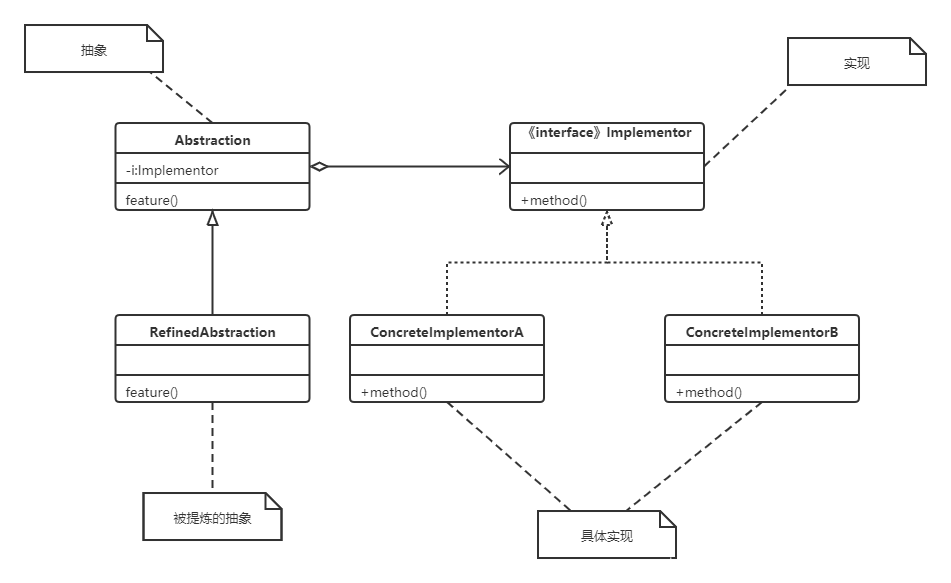

[TOC]

# 桥接模式

桥接模式，将抽象部分与它的实现部分分离，使它们都可以独立地变化。

**问题示例**

假设某个汽车厂商生产三种类型的汽车：轿车、越野车和跑车，每种类型又可以选择燃油、纯电和混合动力。
如果用传统的继承来表示各个最终车型，一共有 3 个抽象类加 9 个最终子类。
如果要新增一个类型（比如皮卡车），或者加一个新的引擎（比如氢能），那么子类的数量增长更快。
所以，桥接模式就是为了避免直接继承带来的子类爆炸。

**作用**

- 实现抽象和实现的分离。
- 桥接模式提高了系统的可扩充性，在两个变化维度中任意扩展一个维度，都不需要修改原有系统。
- 桥接模式有时类似于多继承方案，但是多继承方案违背了类的单一职责原则（即一个类只有一个变化的原因），复用性比较差，而且多继承结构中类的个数非常庞大，桥接模式是比多继承方案更好的解决方法。

**缺点**

- 桥接模式的引入会增加系统的理解与设计难度，由于聚合关联关系建立在抽象层，要求开发者针对抽象进行设计与编程。
- 桥接模式要求正确识别出系统中两个独立变化的维度，因此其使用范围具有一定的局限性。

**适用场景**

- 一个类存在两个独立变化的维度，且这两个维度都需要进行扩展。
- 如果一个系统需要在构建的抽象化角色和具体化角色之间增加更多的灵活性，避免在两个层次之间建立静态的继承联系，通过桥接模式可以使它们在抽象层建立一个关联关系。
- 对于那些不希望使用继承或因为多层次继承导致系统类的个数急剧增加的系统，桥接模式尤为适用。

## 类图



**Implementor（实现类接口）**

定义实现类的接口，这个接口不一定要与 Abstraction 的接口完全一致，事实上这两个接口可以完全不同，一般而言，Implementor 接口仅提供基本操作，而 Abstraction 定义的接口可能会做更多更复杂的操作。Implementor 接口对这些基本操作进行了声明，而具体实现交给其子类。通过关联关系，在 Abstraction 中不仅拥有自己的方法，还可以调用到 Implementor 中定义的方法，使用关联关系来替代继承关系。

**ConcreteImplementor（具体实现类）**

具体实现 Implementor 接口，在不同的 ConcreteImplementor 中提供基本操作的不同实现，在程序运行时，ConcreteImplementor 对象将替换其父类对象，提供给抽象类具体的业务操作方法。

**Abstraction（抽象类）**

用于定义抽象类的接口，它一般是抽象类而不是接口，其中定义了一个 Implementor（实现类接口）类型的对象并可以维护该对象，它与 Implementor 之间具有关联关系。

**RefinedAbstraction（提炼抽象类）**

扩充由 Abstraction 定义的接口，通常情况下它不再是抽象类而是具体类，它实现了在 Abstraction 中声明的抽象业务方法，在 RefinedAbstraction 中可以调用在 Implementor 中定义的业务方法。

## 代码表达

```java
// Implementor（实现类接口）
public interface ICarType {
    void start();

    void run();

    void stop();
}
```

```java
// ConcreteImplementor（具体实现类）
public class SaloonCar implements ICarType {
    @Override
    public void start() {
        System.out.println("SaloonCar-start");
    }

    @Override
    public void run() {
        System.out.println("SaloonCar-run");
    }

    @Override
    public void stop() {
        System.out.println("SaloonCar-stop");
    }
}

public class SUVCar implements ICarType {
    @Override
    public void start() {
        System.out.println("SUVCar-start");
    }

    @Override
    public void run() {
        System.out.println("SUVCar-run");
    }

    @Override
    public void stop() {
        System.out.println("SUVCar-stop");
    }
}

public class SportsCar implements ICarType {
    @Override
    public void start() {
        System.out.println("SportsCar-start");
    }

    @Override
    public void run() {
        System.out.println("SportsCar-run");
    }

    @Override
    public void stop() {
        System.out.println("SportsCar-stop");
    }
}
```

```java
// Abstraction（抽象类）
public abstract class EngineCar {
    private ICarType iCarType;

    public EngineCar(ICarType iCarType) {
        this.iCarType = iCarType;
    }

    public void openEngine() {
        iCarType.start();
        iCarType.run();
    }

    public void chargeEngine() {
        System.out.println("EngineCar-chargeEngine");
    }

    public void closeEngine() {
        iCarType.stop();
    }
}
```

```java
// RefinedAbstraction（提炼抽象类）
public class GasEngineCar extends EngineCar {
    public GasEngineCar(ICarType iCarType) {
        super(iCarType);
    }

    @Override
    public void openEngine() {
        System.out.println("GasEngineCar-openEngine");
        super.openEngine();
    }

    @Override
    public void chargeEngine() {
        System.out.println("GasEngineCar-chargeEngine");
        super.chargeEngine();
    }

    @Override
    public void closeEngine() {
        System.out.println("GasEngineCar-closeEngine");
        super.closeEngine();
    }
}

public class ElectricEngineCar extends EngineCar {
    public ElectricEngineCar(ICarType iCarType) {
        super(iCarType);
    }

    @Override
    public void openEngine() {
        System.out.println("ElectricEngineCar-openEngine");
        super.openEngine();
    }

    @Override
    public void chargeEngine() {
        System.out.println("ElectricEngineCar-chargeEngine");
        super.chargeEngine();
    }

    @Override
    public void closeEngine() {
        System.out.println("ElectricEngineCar-closeEngine");
        super.closeEngine();
    }
}

public class HybridEngineCar extends EngineCar {
    public HybridEngineCar(ICarType iCarType) {
        super(iCarType);
    }

    @Override
    public void openEngine() {
        System.out.println("HybridEngineCar-openEngine");
        super.openEngine();
    }

    @Override
    public void chargeEngine() {
        System.out.println("HybridEngineCar-chargeEngine");
        super.chargeEngine();
    }

    @Override
    public void closeEngine() {
        System.out.println("HybridEngineCar-closeEngine");
        super.closeEngine();
    }
}
```

客户端调用

```java
// 客户端使用；避免直接继承带来的子类爆炸
EngineCar car1 = new GasEngineCar(new SaloonCar());
car1.chargeEngine();
car1.openEngine();
car1.closeEngine();
EngineCar car2 = new ElectricEngineCar(new SUVCar());
car2.chargeEngine();
car2.openEngine();
car2.closeEngine();
EngineCar car3 = new HybridEngineCar(new SportsCar());
car3.chargeEngine();
car3.openEngine();
car3.closeEngine();
```
