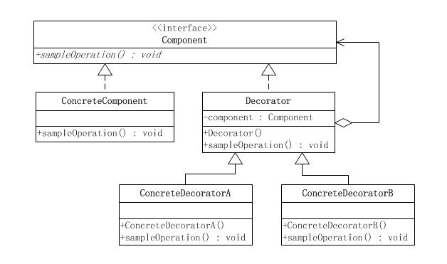

[TOC]

# 装饰者模式

装饰者（Decorator）模式又叫包装器(Wrapper)模式，可以动态地给一个对象扩展功能。就扩展功能来说，装饰者模式比继承更为灵活。

**问题示例**

假设咖啡店有三种咖啡：浓缩咖啡（Espresso）美式咖啡（Americano）拿铁（Latte）
同时又有三种调料：牛奶（Milk），巧克力（Chocolate），蜂蜜（Honey）
不同咖啡可以搭配任意调料，同时调料可以添加多份。且咖啡和调料费用各不相同。
如果用传统的继承来表示各种类型，至少有 9 个最终子类。
如果要新增一个咖啡或者调料，那么子类的数量增长更快。
装饰者模式可以避免直接继承带来的子类爆炸，并且动态扩展功能。

**作用**

- 对于扩展一个对象的功能，装饰者模式比继承更加灵活性，不会导致类的个数急剧增加。
- 可以通过一种动态的方式来扩展一个对象的功能，通过配置文件可以在运行时选择不同的具体装饰类，从而实现不同的行为。
- 可以对一个对象进行多次装饰，通过使用不同的具体装饰类以及这些装饰类的排列组合，可以创造出很多不同行为的组合，得到功能更为强大的对象。
- 具体构件类与具体装饰类可以独立变化，用户可以根据需要增加新的具体构件类和具体装饰类，原有类库代码无须改变，符合 “开闭原则”。

**缺点**

- 使用装饰者模式进行系统设计时将产生很多小对象，这些对象的区别在于它们之间相互连接的方式有所不同，而不是它们的类或者属性值有所不同，大量小对象的产生势必会占用更多的系统资源，在一定程序上影响程序的性能。
- 装饰者模式提供了一种比继承更加灵活机动的解决方案，但同时也意味着比继承更加易于出错，排错也很困难，对于多次装饰的对象，调试时寻找错误可能需要逐级排查，较为繁琐。

**适用场景**

- 在不影响其他对象的情况下，以动态、透明的方式给单个对象添加职责。
- 当不能采用继承的方式对系统进行扩展或者采用继承不利于系统扩展和维护时可以使用装饰者模式。不能采用继承的情况主要有两类：第一类是系统中存在大量独立的扩展，为支持每一种扩展或者扩展之间的组合将产生大量的子类，使得子类数目呈爆炸性增长；第二类是因为类已定义为不能被继承（如 Java 中的 final 类）

## 类图



- 抽象组件(Component) ：定义装饰方法的规范。
- 被装饰者(ConcreteComponent) ：Component 的具体实现，也就是我们要装饰的具体对象。
- 装饰者组件(Decorator) ：持有组件(Component)对象的实例引用，该类的职责就是为了装饰具体组件对象，定义的规范。
- 具体装饰(ConcreteDecorator) ：负责给构件对象装饰附加的功能。

## 代码表达

```java
// 抽象组件(Component)
public abstract class Coffee {
    private String description;
    private int price = 0;

    public String getDescription() {
        return description;
    }

    public void setDescription(String description) {
        this.description = description;
    }

    public int getPrice() {
        return price;
    }

    public void setPrice(int price) {
        this.price = price;
    }

    public abstract int cost();
}
```

```java
// 被装饰者(ConcreteComponent)
public class Espresso extends Coffee {

    public Espresso() {
        setDescription("Espresso");
        setPrice(10);
    }

    @Override
    public int cost() {
        return getPrice();
    }
}

public class Americano extends Coffee {

    public Americano() {
        setDescription("Americano");
        setPrice(20);
    }

    @Override
    public int cost() {
        return getPrice();
    }
}

public class Latte extends Coffee {

    public Latte() {
        setDescription("Latte");
        setPrice(30);
    }

    @Override
    public int cost() {
        return getPrice();
    }
}
```

```java
// 装饰者组件(Decorator)
public class Decorator extends Coffee {
    private Coffee coffee;

    // 继承 Coffee；并内部持有一个 Coffee 与之形成组合关系
    public Decorator(Coffee coffee) {
        this.coffee = coffee;
    }

    @Override
    public int cost() {
        // 自己调料的费用 + Coffee的费用
        return super.getPrice() + coffee.cost();
    }

    @Override
    public String getDescription() {
        // 自己调料的信息 + Coffee的信息
        return super.getDescription() + "-" + coffee.getDescription();
    }
}
```

```java
// 具体装饰(ConcreteDecorator)
public class Milk extends Decorator {
    public Milk(Coffee coffee) {
        super(coffee);
        setDescription("Milk");
        setPrice(1);
    }
}

public class Chocolate extends Decorator {
    public Chocolate(Coffee coffee) {
        super(coffee);
        setDescription("Chocolate");
        setPrice(2);
    }
}

public class Honey extends Decorator {
    public Honey(Coffee coffee) {
        super(coffee);
        setDescription("Honey");
        setPrice(3);
    }
}
```

客户端调用

```java
// 给被装饰者扩展功能
Coffee coffee = new Latte();
coffee = new Milk(coffee);
coffee = new Chocolate(coffee);
coffee = new Honey(coffee);
System.out.println("description:" + coffee.getDescription());
System.out.println("cost:" + coffee.cost());
```
