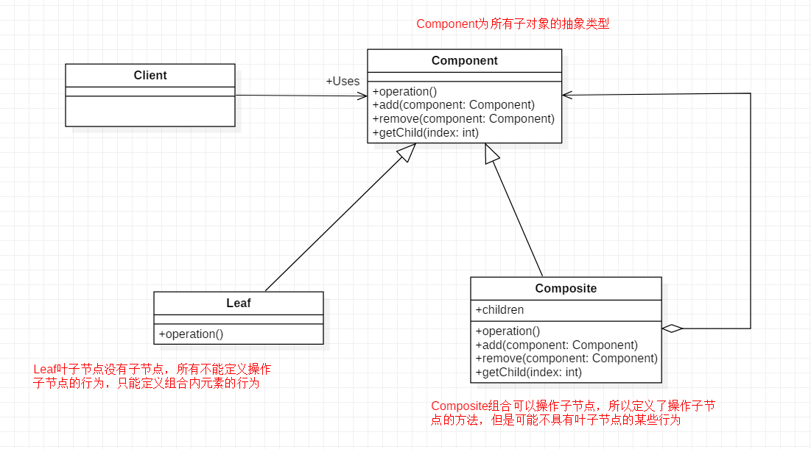

[TOC]

# 组合模式

组合模式（Composite）又称部分-整体模式，将对象组合成树形结构以表示“部分-整体”的层次结构，使得用户对单个对象和组合对象的使用具有一致性。

**问题示例**

按层级获取省市区的数据。

**作用**

- 组合模式使得客户端代码可以一致地处理单个对象和组合对象，无须关心自己处理的是单个对象，还是组合对象，这简化了客户端代码
- 更容易在组合体内加入新的对象，客户端不会因为加入了新的对象而更改源代码，满足“开闭原则”

**缺点**

- 设计较复杂，客户端需要花更多时间理清类之间的层次关系。
- 在增加新构件时很难对容器中的构件类型进行限制。

**适用场景**

- 表示对象的部分-整体层次结构，如树形菜单，文件夹的管理，遍历组织架构，或者处理的对象具有树形结构，非常适合使用组合模式。
- 希望用户忽略组合对象与单个对象的不同，用户将统一地使用组合结构中的所有对象。
- 如果整体和部分有很多差异的话，比如很多方法和属性都不一样，不适合使用组合模式。

## 类图



- 抽象构件角色(Component)：主要作用是为树叶构件和树枝构件声明公共接口，并实现它们的默认行为。
- 树枝构件角色(Composite)：是组合中的分支节点对象，它有子节点。它实现了抽象构件角色中声明的接口，它的主要作用是存储和管理子部件，通常包含 Add()/Remove()/GetChild() 等方法。
- 树叶构件角色(Leaf)：是组合中的叶节点对象，它没有子节点，用于实现抽象构件角色中声明的公共接口。

## 代码表达

```java
// 抽象构件角色(Component)
public abstract class AddressComponent {
    private String name;

    public AddressComponent(String name) {
        this.name = name;
    }

    public String getName() {
        return name;
    }

    public void setName(String name) {
        this.name = name;
    }

    public void add(AddressComponent address) {
        // 默认实现，防止树叶构件角色调用
        throw new UnsupportedOperationException();
    }

    public void remove(AddressComponent address) {
        // 默认实现，防止树叶构件角色调用
        throw new UnsupportedOperationException();
    }

    // 所有子类需要实现的具体操作
    public abstract void print();
}
```

```java
// 树枝构件角色(Composite)
public class Province extends AddressComponent {
    // 存储和管理子部件
    List<AddressComponent> list = new ArrayList<>();

    public Province(String name) {
        super(name);
    }

    @Override
    public void add(AddressComponent address) {
        list.add(address);
    }

    @Override
    public void remove(AddressComponent address) {
        list.remove(address);
    }

    @Override
    public void print() {
        // 递归调用子部件的方法
        System.out.println("===" + getName() + "===");
        for (AddressComponent address : list) {
            address.print();
        }
    }
}

public class City extends AddressComponent {
    // 存储和管理子部件
    List<AddressComponent> list = new ArrayList<>();

    public City(String name) {
        super(name);
    }

    @Override
    public void add(AddressComponent address) {
        list.add(address);
    }

    @Override
    public void remove(AddressComponent address) {
        list.remove(address);
    }

    @Override
    public void print() {
        // 递归调用子部件的方法
        System.out.println("---" + getName() + "---");
        for (AddressComponent address : list) {
            address.print();
        }
    }
}
```

```java
// 树叶构件角色(Leaf)
public class District extends AddressComponent {
    // 叶子节点没有子节点，不需要 add/remove 等管理方法
    public District(String name) {
        super(name);
    }

    @Override
    public void print() {
        System.out.println(getName());
    }
}
```

客户端调用

```java
AddressComponent guangdong = new Province("guangdong");
AddressComponent guangzhou = new City("guangzhou");
AddressComponent shenzhen = new City("shenzhen");
guangdong.add(guangzhou);
guangdong.add(shenzhen);
AddressComponent tianhe = new District("tianhe");
AddressComponent yuexiu = new District("yuexiu");
guangzhou.add(tianhe);
guangzhou.add(yuexiu);
AddressComponent longhua = new District("longhua");
AddressComponent baoan = new District("baoan");
shenzhen.add(longhua);
shenzhen.add(baoan);
guangdong.print();
```
