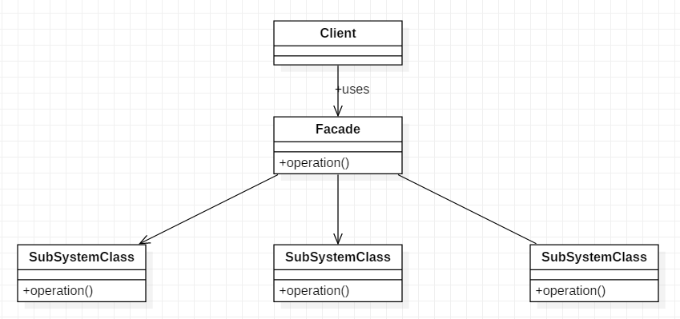

[TOC]

# 外观模式

外观（Facade）模式，也叫门面模式，外部与一个子系统的通信必须通过一个统一的外观对象进行，为子系统中的一组接口提供一个一致的界面，外观模式定义了一个高层接口，这个接口使得这一子系统更加容易使用。

**作用**

- 对客户端屏蔽了子系统组件，减少了客户端所需关联的对象数目，并使得子系统使用起来更加容易。
- 实现了子系统与客户端之间的松耦合关系，这使得子系统的变化不会影响到调用它的客户端，只需要调整外观类即可。
- 一个子系统的修改对其他子系统没有任何影响，而且子系统内部变化也不会影响到外观对象。

**缺点**

- 不能很好地限制客户端直接使用子系统类，如果对客户端访问子系统类做太多的限制则减少了可变性和灵活性。
- 如果设计不当，增加新的子系统可能需要修改外观类或者客户端的源代码，违背了开闭原则。

**适用场景**

- 当要为访问一系列复杂的子系统提供一个简单入口时可以使用外观模式。
- 客户端程序与多个子系统之间存在很大的依赖性。引入外观类可以将子系统与客户端解耦，从而提高子系统的独立性和可移植性。
- 在层次化结构中，可以使用外观模式定义系统中每一层的入口，层与层之间不直接产生联系，而通过外观类建立联系，降低层之间的耦合度。

## 类图



- 子系统（Sub System）角色：实现系统的部分功能，客户可以通过外观角色访问它。
- 外观（Facade）角色：为多个子系统对外提供一个共同的接口。
- 客户（Client）角色：通过一个外观角色访问各个子系统的功能。

## 代码表达

```java
// 子系统（Sub System）角色
public class CPU {
    public void start() {
        System.out.println("cpu start");
    }

    public void stop() {
        System.out.println("cpu stop");
    }
}

public class Memory {
    public void loadData() {
        System.out.println("memory loadData");
    }

    public void unloadData() {
        System.out.println("memory unloadData");
    }
}

public class Disk {
    public void readData() {
        System.out.println("disk readData");
    }

    public void closeData() {
        System.out.println("disk closeData");
    }
}
```

```java
// 外观（Facade）角色
public class Computer {
    private CPU cpu;
    private Memory memory;
    private Disk disk;

    public Computer() {
        cpu = new CPU();
        memory = new Memory();
        disk = new Disk();
    }

    public void startup() {
        System.out.println("Computer startup");
        cpu.start();
        memory.loadData();
        disk.readData();
    }

    public void shutdown() {
        System.out.println("Computer shutdown");
        cpu.stop();
        memory.unloadData();
        disk.closeData();
    }
}
```

```java
// 客户（Client）角色；客户端调用
Computer computer = new Computer();
computer.startup();
computer.shutdown();
```
