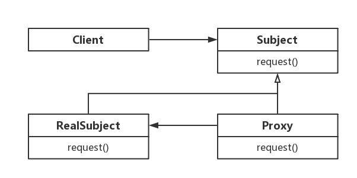

[TOC]

# 代理模式

代理（Proxy）模式，为其他对象提供一个代理以控制对该对象的访问。

**作用**

- 代理模式在客户端与目标对象之间起到一个中介作用和保护目标对象的作用；
- 代理对象可以扩展目标对象的功能；
- 代理模式能将客户端与目标对象分离，职责清晰，在一定程度上降低了系统的耦合度，增加了程序的可扩展性

**缺点**

- 静态代理模式会造成系统设计中类的数量增加，但动态代理可以解决这个问题；
- 在客户端和目标对象之间增加一个代理对象，会造成请求处理速度变慢；
- 增加了系统的复杂度；

**适用场景**

当无法或不想直接引用某个对象或访问某个对象存在困难时，可以通过代理对象来间接访问。
使用代理模式主要有两个目的：一是保护目标对象，二是增强目标对象。

- 远程代理，这种方式通常是为了隐藏目标对象存在于不同地址空间的事实，方便客户端访问。例如，用户申请某些网盘空间时，会在用户的文件系统中建立一个虚拟的硬盘，用户访问虚拟硬盘时实际访问的是网盘空间。
- 虚拟代理，这种方式通常用于要创建的目标对象开销很大时。例如，下载一幅很大的图像需要很长时间，因某种计算比较复杂而短时间无法完成，这时可以先用小比例的虚拟代理替换真实的对象，消除用户对服务器慢的感觉。
- 安全代理，这种方式通常用于控制不同种类客户对真实对象的访问权限。
- 智能指引，主要用于调用目标对象时，代理附加一些额外的处理功能。例如，增加计算真实对象的引用次数的功能，这样当该对象没有被引用时，就可以自动释放它。
- 延迟加载，指为了提高系统的性能，延迟对目标的加载。例如，Hibernate 中就存在属性的延迟加载和关联表的延时加载。

## 类图



- 抽象主题（Subject）类：通过接口或抽象类声明真实主题和代理对象实现的业务方法。
- 真实主题（Real Subject）类：实现了抽象主题中的具体业务，是代理对象所代表的真实对象，是最终要引用的对象（被代理的角色）。
- 代理（Proxy）类：提供了与真实主题相同的接口，其内部含有对真实主题的引用，它可以访问、控制或扩展真实主题的功能。

## 静态代理

由开发人员创建代理类或特定工具自动生成源代码再对其编译，在程序运行前代理类的 .class 文件就已经存在了

```java
// 抽象主题（Subject）类
public interface ITeacherDao {
    void teach();
}

// 真实主题（Real Subject）类
public class TeacherDao implements ITeacherDao {
    @Override
    public void teach() {
        System.out.println("TeacherDao teach()");
    }
}

// 代理（Proxy）类
public class TeacherDaoProxy implements ITeacherDao {
    // 目标对象
    private ITeacherDao target;

    public TeacherDaoProxy(ITeacherDao target) {
        this.target = target;
    }

    @Override
    public void teach() {
        // 在目标对象执行前以及执行后扩展功能
        System.out.println("before teach()");
        target.teach();
        System.out.println("after teach()");
    }
}
```

客户端调用

```java
ITeacherDao target = new TeacherDao();
TeacherDaoProxy proxy = new TeacherDaoProxy(target);
proxy.teach();
```

## 动态代理

在程序运行时，运用反射机制动态创建而成

- 代理对象不需要实现接口，但是目标对象仍然要实现接口
- 代理对象的生成，是通过 JDK 的 API，动态的在内存中构建代理对象
- 动态代理也称为 JDK 代理、接口代理

> CGLIB 代理也属于动态代理，基于 CGLIB 开源库实现 JDK 代理类似功能

```java
// 抽象主题（Subject）类
public interface ITeacherDao {
    void teach();

    void sayHello(String name);
}

// 真实主题（Real Subject）类
public class TeacherDao implements ITeacherDao {
    @Override
    public void teach() {
        System.out.println("TeacherDao teach()");
    }

    @Override
    public void sayHello(String name) {
        System.out.println("Hello:" + name);
    }
}

// 代理（Proxy）类
public class ProxyFactory {
    // 目标对象
    private Object target;

    public ProxyFactory(Object target) {
        this.target = target;
    }

    public Object getProxyInstance() {
        // ClassLoader loader:目标对象使用的加载器
        ClassLoader loader = target.getClass().getClassLoader();
        // Class<?>[] interfaces:目标对象实现的接口类型
        Class<?>[] interfaces = target.getClass().getInterfaces();
        // InvocationHandler handler:调用处理器，执行目标对象方法时，会触发调用处理器
        InvocationHandler handler = new InvocationHandler() {
            @Override
            public Object invoke(Object proxy, Method method, Object[] args) throws Throwable {
                // 只代理 teach 方法，其余方法仍执行原逻辑
                if (!("teach".equals(method.getName()))) {
                    System.out.println("proxy error");
                    return method.invoke(target, args);
                }
                // 在目标对象执行前扩展功能
                System.out.println("before teach()");
                // 反射机制调用目标对象的方法
                // Method method:目标对象被调用的方法
                // Object[] args:目标对象被调用的方法中的参数
                // Object resVal:标对象被调用的方法的返回值
                Object resVal = method.invoke(target, args);
                // 在目标对象执行后扩展功能
                System.out.println("after teach()");
                return resVal;
            }
        };
        return Proxy.newProxyInstance(loader, interfaces, handler);
    }
}
```

客户端调用

```java
ITeacherDao target = new TeacherDao();
ITeacherDao proxyInstance = (ITeacherDao) new ProxyFactory(target).getProxyInstance();
proxyInstance.teach();
proxyInstance.sayHello("Nemo");
```
