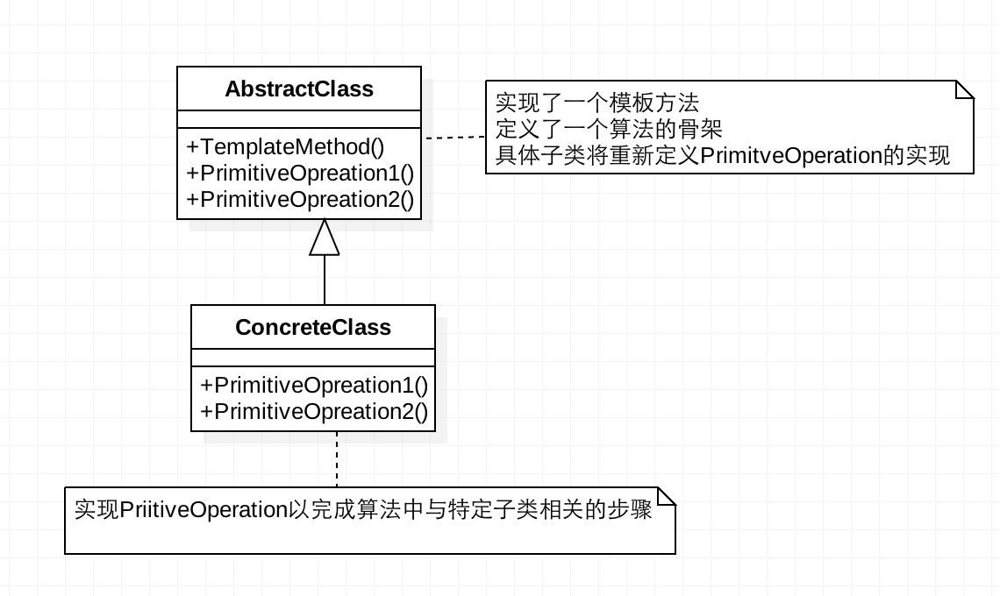

[TOC]

# 模板模式

模板模式，又称为模板方法模式；定义一个操作中的算法的骨架，而将一些步骤延迟到子类中，使得子类可以不改变一个算法的结构即可重定义该算法的某些特定步骤。

**作用**

- 封装不变部分，扩展可变部分。
- 提取公共代码，便于维护。
- 行为由父类控制，子类实现。
- 提高代码复用性，将相同部分的代码放在抽象的父类中
- 提高了拓展性，将不同的代码放入不同的子类中，通过对子类的扩展增加新的行为
- 实现了反向控制，通过一个父类调用其子类的操作，通过对子类的扩展增加新的行为，实现了反向控制以及符合“开闭原则”

**缺点**

- 每一个不同的实现都需要一个子类来实现，导致类的个数增加，使得系统更加庞大。
- 如果“算法流程”开放太多步骤，并要求子类必须全部重新实现的话，反而会造成实现的困难，也不容易维护。

**适用场景**

- 有多个子类共有的方法，且逻辑相同。
- 一次性实现一个算法的不变的部分，并将可变行为留给子类来实现。
- 各子类中公共的行为被提取出来并集中到一个公共父类中，从而避免代码重复。

## 类图



**AbstractTemplate（抽象类）**

在抽象类中定义了一系列基本操作，这些基本操作可以是具体的，也可以是抽象的，每一个基本操作对应算法的一个步骤，在其子类中可以重定义或实现这些步骤。
同时，在抽象类中实现了一个模板方法(Template Method)，用于定义一个算法的框架，模板方法不仅可以调用在抽象类中实现的基本方法，也可以调用在抽象类的子类中实现的基本方法，还可以调用其他对象中的方法。

**ConcreteTemplate（具体子类）**

它是抽象类的子类，用于实现在父类中声明的抽象基本操作以完成子类特定算法的步骤，也可以覆盖在父类中已经实现的具体基本操作。

## 模板抽象类方法类型

- 模板方法：定义统一模板算法的方法，提供实现方法，子类一般不需要重写；可以将模板方法声明为 final，防止子类重写模板方法。
- 具体方法：在抽象类中声明并实现，在具体子类中可以继承或重写。
- 抽象方法：在抽象类声明，由其具体子类实现。
- 钩子方法：在抽象类中声明并实现（可以是空的实现），子类视情况进行重写覆盖，一般是逻辑判断方法。

## 代码表达

```java
// AbstractTemplate（抽象类）
public abstract class WashingMachine {

    // 模板方法：定义统一模板算法的方法，提供实现方法，子类一般不需要重写
    public final void work() {
        putClothes();
        putShampoo();
        fullWater();
        cleanClothes();
        if (isNeedDrying()) {
            dryingClothes();
        }
    }

    // 具体方法：在抽象类中声明并实现，在具体子类中可以继承或重写。
    public void putClothes() {
        System.out.println("putClothes");
    }

    // 抽象方法：在抽象类声明，由其具体子类实现。
    public abstract void putShampoo();

    public void fullWater() {
        System.out.println("fullWater");
    }

    public void cleanClothes() {
        System.out.println("cleanClothes");
    }

    public void dryingClothes() {
        System.out.println("dryingClothes");
    }

    // 钩子方法：在抽象类中声明并实现（可以是空的实现），子类视情况进行重写覆盖
    public boolean isNeedDrying() {
        return true;
    }
}
```

```java
// ConcreteTemplate（具体子类）
public class WaveWashingMachine extends WashingMachine {
    @Override
    public void putShampoo() {
        System.out.println("WaveWashingMachine putShampoo");
    }
}

public class RollerWashingMachine extends WashingMachine {
    @Override
    public void putShampoo() {
        System.out.println("RollerWashingMachine putShampoo");
    }

    @Override
    public boolean isNeedDrying() {
        return false;
    }
}
```

客户端调用

```java
WashingMachine machine = new WaveWashingMachine();
machine.work();
WashingMachine machine2 = new RollerWashingMachine();
machine2.work();
```
