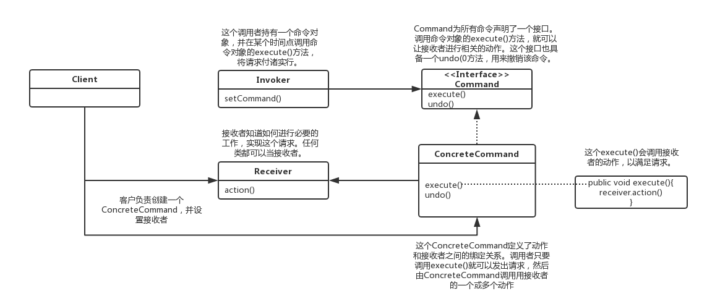

[TOC]

# 命令模式

命令模式，将一个请求封装成一个对象，从而让你使用不同的请求把客户端参数化，对请求排队或记录请求日志，以及支持可撤销的操作。

**作用**

- 类间解耦：命令模式能将调用操作的对象与实现该操作的对象解耦。
- 可扩展性：增加或删除命令非常方便。采用命令模式增加与删除命令不会影响其他类，它满足“开闭原则”，对扩展比较灵活。

**缺点**

可能产生大量具体命令类。因为计对每一个具体操作都需要设计一个具体命令类，这将增加系统的复杂性。

**适用场景**

命令模式主要解决的问题是在软件系统中，行为请求者与行为实现者通常是一种紧耦合的关系，但某些场合，比如需要对行为进行记录、撤销或重做、事务等处理时，这种无法抵御变化的紧耦合的设计就不太合适。这种时候就适合使用命令模式。

## 类图



- 抽象命令类（Command）角色：声明执行命令的接口，拥有执行命令方法和撤销方法。
- 具体命令角色（ConcreteCommand）角色：是抽象命令类的具体实现类，它拥有接收者对象，并通过调用接收者的功能来完成命令要执行的操作。
- 命令接收者（Receiver）角色：执行命令功能的相关操作，是具体命令对象业务的真正实现者。
- 命令调用者（Invoker）角色：是请求的发送者，它通常拥有很多的命令对象，并通过访问命令对象来执行相关请求，它不直接访问接收者。

## 代码表达

```java
// 抽象命令类（Command）角色
public interface Command {
    void execute();
    void undo();
}
```

```java
// 具体命令角色（ConcreteCommand）角色
public class LightOnCommand implements Command {
    LightReceiver receiver;

    public LightOnCommand(LightReceiver receiver) {
        this.receiver = receiver;
    }

    @Override
    public void execute() {
        receiver.on();
    }

    @Override
    public void undo() {
        receiver.off();
    }
}

public class LightOffCommand implements Command {
    LightReceiver receiver;

    public LightOffCommand(LightReceiver receiver) {
        this.receiver = receiver;
    }

    @Override
    public void execute() {
        receiver.off();
    }

    @Override
    public void undo() {
        receiver.on();
    }
}

public class TVOnCommand implements Command {
    TVReceiver receiver;

    public TVOnCommand(TVReceiver receiver) {
        this.receiver = receiver;
    }

    @Override
    public void execute() {
        receiver.on();
    }

    @Override
    public void undo() {
        receiver.off();
    }
}

public class TVOffCommand implements Command {
    TVReceiver receiver;

    public TVOffCommand(TVReceiver receiver) {
        this.receiver = receiver;
    }

    @Override
    public void execute() {
        receiver.off();
    }

    @Override
    public void undo() {
        receiver.on();
    }
}

// 空命令；作为默认命令
public class NoCommand implements Command {
    @Override
    public void execute() {
        System.out.println("NoCommand execute()");
    }

    @Override
    public void undo() {
        System.out.println("NoCommand undo()");
    }
}
```

```java
// 命令接收者（Receiver）角色
public class LightReceiver {
    public void on() {
        System.out.println("LightReceiver on()");
    }

    public void off() {
        System.out.println("LightReceiver off()");
    }
}

class TVReceiver {
    public void on() {
        System.out.println("TVReceiver on()");
    }

    public void off() {
        System.out.println("TVReceiver off()");
    }
}
```

```java
// 命令调用者（Invoker）角色
public class RemoteControl {
    // 打开命令
    private Command[] onCommands;
    // 关闭命令
    private Command[] offCommands;
    // 撤销命令
    private Command undoCommand;
    // 命令类型数目
    private int commandSize = 5;

    public RemoteControl() {
        onCommands = new Command[commandSize];
        offCommands = new Command[commandSize];
        for (int i = 0; i < commandSize; i++) {
            onCommands[i] = new NoCommand();
            offCommands[i] = new NoCommand();
        }
    }

    public void setCommand(int index, Command onCommand, Command offCommand) {
        onCommands[index] = onCommand;
        offCommands[index] = offCommand;
    }

    public void onButtonKeyDown(int index) {
        onCommands[index].execute();
        // 记录当前执行命令，用于撤销
        undoCommand = onCommands[index];
    }

    public void offButtonKeyDown(int index) {
        offCommands[index].execute();
        // 记录当前执行命令，用于撤销
        undoCommand = offCommands[index];
    }

    public void undoButtonKeyDown(int index) {
        undoCommand.undo();
    }
}
```

客户端调用

```java
RemoteControl control = new RemoteControl();
// 执行第1组命令
LightReceiver lightReceiver = new LightReceiver();
LightOnCommand lightOnCommand = new LightOnCommand(lightReceiver);
LightOffCommand lightOffCommand = new LightOffCommand(lightReceiver);
control.setCommand(0, lightOnCommand, lightOffCommand);
control.onButtonKeyDown(0);
control.offButtonKeyDown(0);
control.undoButtonKeyDown(0);
// 执行第2组命令
TVReceiver tvReceiver = new TVReceiver();
TVOnCommand tvOnCommand = new TVOnCommand(tvReceiver);
TVOffCommand tvOffCommand = new TVOffCommand(tvReceiver);
control.setCommand(1, tvOnCommand, tvOffCommand);
control.onButtonKeyDown(1);
control.offButtonKeyDown(1);
control.undoButtonKeyDown(1);
```
