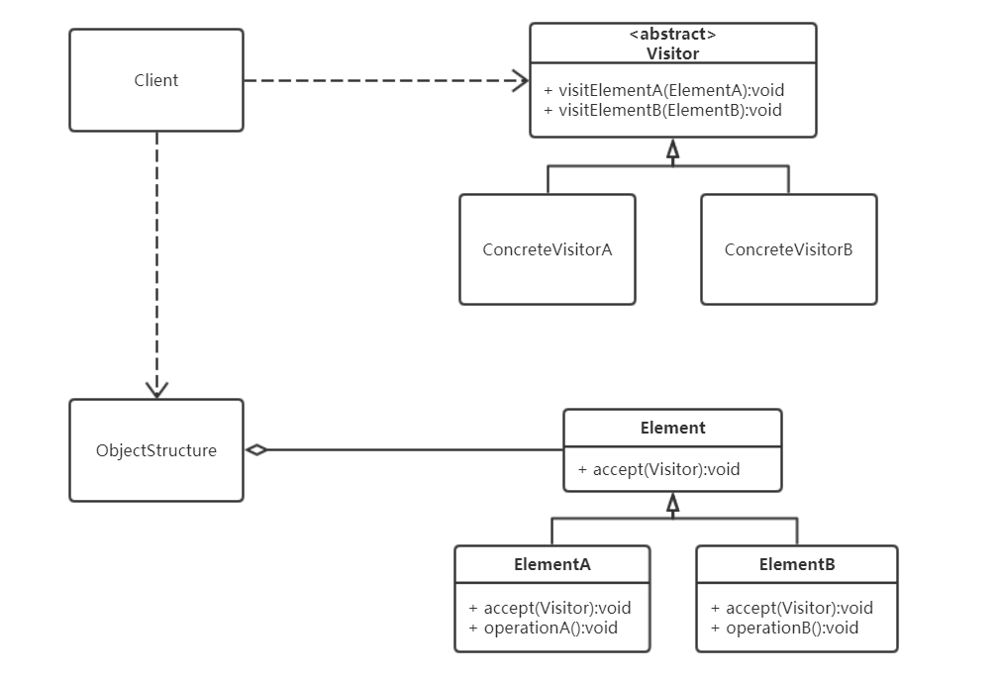

[TOC]

# 访问者模式

访问者模式是一种将数据结构和数据操作分离的设计模式，解决数据结构和操作数据耦合性的问题。

**作用**

- 符合单一职责原则。
- 优秀的扩展性和灵活性，新增访问者和元素都比较方便。
- 访问者可以对功能进行统一，可以做报表、UI、拦截器与过滤器。

**缺点**

- 具体元素对访问者公布细节，违反了迪米特原则。导致具体元素变更比较困难。
- 违反了依赖倒置原则。访问者依赖了具体元素类，没有依赖抽象。

**适用场景**

- 对象结构比较稳定，但经常需要在此对象结构上定义新的操作。
- 需要对一个对象结构中的对象进行很多不同的并且不相关的操作，而需要避免这些操作“污染”这些对象的类，也不希望在增加新操作时修改这些类。

## 类图



**Visitor：访问者接口或者抽象类**

定义了对每个 Element 访问的行为，它的参数就是被访问的元素。
它的方法个数理论上与元素的个数是一样的，因此，访问者模式要求元素的类型要稳定。
如果经常添加、移除元素类，必然会导致频繁地修改 Visitor 接口，如果出现这种情况，则说明不适合使用访问者模式。

**ConcreteVisitor：具体的访问者**

它需要给出对每一个元素类访问时所产生的具体行为。

**Element：元素接口或者抽象类**

它定义了一个接受访问者（accept）的方法，其意义是指每一个元素都要可以被访问者访问。

**ConcreteElement：具体的元素类**

它提供接受访问的具体实现，而这个具体的实现，通常情况下是使用访问者提供的访问该元素类的方法。

**ObjectStructure：定义当中所提到的对象结构**

对象结构是一个抽象表述，它内部管理了元素集合，并且可以迭代这些元素提供访问者访问。

## 代码表达

**双重分派**

- 客户端将访问者作为参数传递到元素具体子类
- 然后在元素具体子类中，将自己（this）作为参数，调用具体访问者中的方法

```java
// Visitor：访问者接口或者抽象类
public abstract class Action {
    public abstract void getManResult(Man man);
    public abstract void getWomanResult(Woman woman);
}
```

```java
// ConcreteVisitor：具体的访问者
public class Success extends Action {
    @Override
    public void getManResult(Man man) {
        System.out.println("man result:Success");
    }

    @Override
    public void getWomanResult(Woman woman) {
        System.out.println("woman result:Success");
    }
}

public class Fail extends Action {
    @Override
    public void getManResult(Man man) {
        System.out.println("man result:Fail");
    }

    @Override
    public void getWomanResult(Woman woman) {
        System.out.println("woman result:Fail");
    }
}
```

```java
// Element：元素接口或者抽象类
public abstract class Person {
    private boolean isActionFinish = false;

    public abstract void accept(Action action);

    public void actionFinish() {
        isActionFinish = true;
    }

    public boolean getActionFinish() {
        return isActionFinish;
    }
}
```

```java
// ConcreteElement：具体的元素类
public class Man extends Person {
    @Override
    public void accept(Action action) {
        if (!getActionFinish()) {
            action.getManResult(this);
            actionFinish();
        }
    }
}

public class Woman extends Person {
    @Override
    public void accept(Action action) {
        if (!getActionFinish()) {
            action.getWomanResult(this);
            actionFinish();
        }
    }
}
```

```java
// ObjectStructure：对象结构类，内部管理了元素集合
public class ObjectStructure {
    // 内部管理了元素集合
    private List<Person> list = new LinkedList<>();

    public void add(Person person) {
        list.add(person);
    }

    public void remove(Person person) {
        list.remove(person);
    }

    public void showResult(Action action) {
        for (Person person : list) {
            person.accept(action);
        }
    }
}
```

客户端调用

```java
ObjectStructure structure = new ObjectStructure();
structure.add(new Woman());
structure.add(new Woman());
Success success = new Success();
structure.showResult(success);

structure.add(new Man());
structure.add(new Man());
Fail fail = new Fail();
structure.showResult(fail);
```
