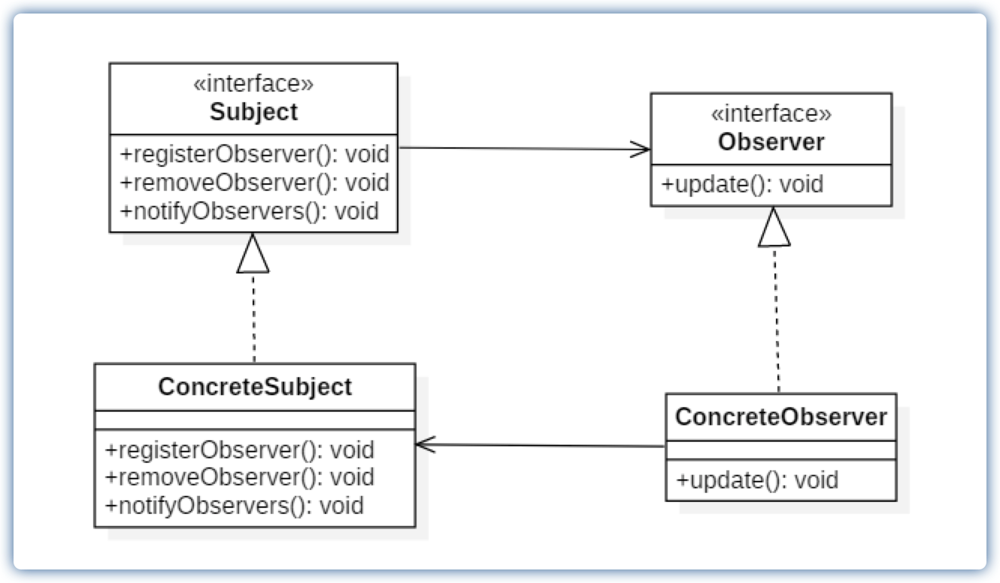

[TOC]

# 观察者模式

观察者模式（Observer）又称发布-订阅模式（Pub/Sub），定义对象间的一种一对多的依赖关系，当一个对象的状态发生改变时，所有依赖于它的对象都得到通知并被自动更新。

**作用**

- 降低了目标与观察者之间的耦合关系，两者之间是抽象耦合关系。
- 目标与观察者之间建立了一套触发机制。

**缺点**

- 目标与观察者之间的依赖关系并没有完全解除，而且有可能出现循环引用。
- 当观察者对象很多时，通知的发布会花费很多时间，影响程序的效率。

**适用场景**

- 对象间存在一对多关系，一个对象的状态发生改变会影响其他对象。
- 当一个抽象模型有两个方面，其中一个方面依赖于另一方面时，可将这二者封装在独立的对象中以使它们可以各自独立地改变和复用。

## 类图



- 抽象主题（Subject）角色：也叫抽象目标类，它提供了一个用于保存观察者对象的聚集类和增加、删除观察者对象的方法，以及通知所有观察者的抽象方法。
- 具体主题（Concrete Subject）角色：也叫具体目标类，它实现抽象目标中的通知方法，当具体主题的内部状态发生改变时，通知所有注册过的观察者对象。
- 抽象观察者（Observer）角色：它是一个抽象类或接口，它包含了一个更新自己的抽象方法，当接到具体主题的更改通知时被调用。
- 具体观察者（Concrete Observer）角色：实现抽象观察者中定义的抽象方法，以便在得到目标的更改通知时更新自身的状态。

## 代码表达

```java
// 抽象主题（Subject）角色
public interface Subject {
    void registerObserver(Observer observer);
    void removeObserver(Observer observer);
    void notifyObservers();
}
```

```java
// 具体主题（Concrete Subject）角色
public class WeatherData implements Subject {
    private int temperature;
    private int pressure;
    private int humidity;

    private List<Observer> observers = new ArrayList<>();

    public void setData(int temperature, int pressure, int humidity) {
        this.temperature = temperature;
        this.pressure = pressure;
        this.humidity = humidity;
    }

    @Override
    public void registerObserver(Observer observer) {
        observers.add(observer);
    }

    @Override
    public void removeObserver(Observer observer) {
        observers.remove(observer);
    }

    @Override
    public void notifyObservers() {
        for (int i = 0; i < observers.size(); i++) {
            observers.get(i).update(temperature, pressure, humidity);
        }
    }
}
```

```java
// 抽象观察者（Observer）角色
public interface Observer {
    void update(int temperature, int pressure, int humidity);
}
```

```java
// 具体观察者（Concrete Observer）角色
public class BaiduSite implements Observer {
    private int temperature;
    private int pressure;
    private int humidity;

    @Override
    public void update(int temperature, int pressure, int humidity) {
        this.temperature = temperature;
        this.pressure = pressure;
        this.humidity = humidity;
        show();
    }

    private void show() {
        System.out.println("BaiduSite:" + temperature);
        System.out.println("BaiduSite:" + pressure);
        System.out.println("BaiduSite:" + humidity);
    }
}

public class SinaSite implements Observer {
    private int temperature;
    private int pressure;
    private int humidity;

    @Override
    public void update(int temperature, int pressure, int humidity) {
        this.temperature = temperature;
        this.pressure = pressure;
        this.humidity = humidity;
        show();
    }

    private void show() {
        System.out.println("SinaSite:" + temperature);
        System.out.println("SinaSite:" + pressure);
        System.out.println("SinaSite:" + humidity);
    }
}
```

客户端调用

```java
WeatherData weatherData = new WeatherData();
BaiduSite baiduSite = new BaiduSite();
SinaSite sinaSite = new SinaSite();
// 注册观察者
weatherData.registerObserver(baiduSite);
weatherData.registerObserver(sinaSite);
// 更新数据并通知观察者
weatherData.setData(10, 20, 30);
weatherData.notifyObservers();
weatherData.setData(20, 30, 40);
weatherData.notifyObservers();
// 移除观察者
weatherData.removeObserver(baiduSite);
weatherData.notifyObservers();
```
