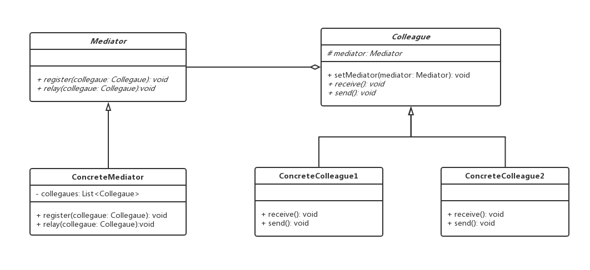

[TOC]

# 中介者模式

中介模式（Mediator）又称调停者模式，用一个中介对象来封装一系列的对象交互。中介者使各个对象不需要显式地相互引用，从而使其耦合松散，而且可以独立地改变它们之间的交互。

**作用**

- 降低了对象之间的耦合性，使得对象易于独立地被复用。
- 将对象间的一对多关联转变为一对一的关联，提高系统的灵活性，使得系统易于维护和扩展。

**缺点**

在具体中介者类中包含了同事之间的交互细节，可能会导致具体中介者类非常复杂，使得系统难以维护。

**适用场景**

- 系统中对象之间存在复杂的引用关系，产生的相互依赖关系导致结构混乱且难以理解。
- 一个对象由于引用了其他很多对象并且直接和这些对象通信，导致难以复用该对象。
- 想通过一个中间类来封装多个类中的行为，而又不想生成太多的子类。可以通过引入中介者类来实现，在中介者中定义对象交互的公共行为，如果需要改变行为则可以增加新的中介者类。

## 类图



- 抽象中介者（Mediator）角色：它是中介者的接口，提供了同事对象注册与转发同事对象信息的抽象方法。
- 具体中介者（ConcreteMediator）角色：实现中介者接口，定义一个 List 来管理同事对象，协调各个同事角色之间的交互关系，因此它依赖于同事角色。
- 抽象同事类（Colleague）角色：定义同事类的接口，保存中介者对象，提供同事对象交互的抽象方法，实现所有相互影响的同事类的公共功能。
- 具体同事类（Concrete Colleague）角色：是抽象同事类的实现者，当需要与其他同事对象交互时，由中介者对象负责后续的交互。

## 代码表达

```java
// 抽象中介者（Mediator）角色
public abstract class Mediator {
    public abstract void register(String name, Colleague colleague);
    public abstract void getMessage(int state, String name);
}
```

```java
// 具体中介者（ConcreteMediator）角色
public class ConcreteMediator extends Mediator {
    public static final String ALARM_TAG = "Alarm";
    public static final String CURTAIN_TAG = "Curtain";
    public static final String TV_TAG = "TV";

    private HashMap<String, Colleague> colleagueMap;

    public ConcreteMediator() {
        this.colleagueMap = new HashMap<>();
    }

    @Override
    public void register(String name, Colleague colleague) {
        colleagueMap.put(name, colleague);
    }

    @Override
    public void getMessage(int state, String name) {
        // 中介者接受消息，协调各个具体的同事对象完成具体逻辑
        if (colleagueMap.get(name) instanceof Alarm) {
            System.out.println("getMessage Alarm");
            if (state == 0) {
                ((TV) (colleagueMap.get(TV_TAG))).startTV();
                ((Curtain) (colleagueMap.get(CURTAIN_TAG))).upCurtain();
            } else {
                ((TV) (colleagueMap.get(TV_TAG))).stopTV();
            }
        }
        if (colleagueMap.get(name) instanceof TV) {
            System.out.println("getMessage TV");
        }
        if (colleagueMap.get(name) instanceof Curtain) {
            System.out.println("getMessage Curtain");
        }
    }
}
```

```java
// 抽象同事类（Colleague）角色
public abstract class Colleague {
    private Mediator mediator;
    private String name;

    public Colleague(Mediator mediator, String name) {
        this.mediator = mediator;
        this.name = name;
        mediator.register(name, this);
    }

    public Mediator getMediator() {
        return mediator;
    }

    public String getName() {
        return name;
    }

    public abstract void sendMessage(int state);
}
```

```java
// 具体同事类（Concrete Colleague）角色
public class Alarm extends Colleague {
    public Alarm(Mediator mediator, String name) {
        super(mediator, name);
    }

    public void sendAlarm(int state) {
        System.out.println("sendAlarm");
        sendMessage(state);
    }

    @Override
    public void sendMessage(int state) {
        getMediator().getMessage(state, getName());
    }
}

public class Curtain extends Colleague {
    public Curtain(Mediator mediator, String name) {
        super(mediator, name);
    }

    public void upCurtain() {
        System.out.println("upCurtain");
    }

    @Override
    public void sendMessage(int state) {
        getMediator().getMessage(state, getName());
    }
}

public class TV extends Colleague {
    public TV(Mediator mediator, String name) {
        super(mediator, name);
    }

    public void startTV() {
        System.out.println("startTV");
    }

    public void stopTV() {
        System.out.println("stopTV");
    }

    @Override
    public void sendMessage(int state) {
        getMediator().getMessage(state, getName());
    }
}
```

客户端调用

```java
// 创建具体同事类，并关联中介者
Mediator mediator = new ConcreteMediator();
Alarm alarm = new Alarm(mediator, ConcreteMediator.ALARM_TAG);
Curtain curtain = new Curtain(mediator, ConcreteMediator.CURTAIN_TAG);
TV tv = new TV(mediator, ConcreteMediator.TV_TAG);
// 具体的同事类发送消息
alarm.sendAlarm(0);
alarm.sendAlarm(1);
curtain.sendMessage(0);
tv.sendMessage(0);
```
