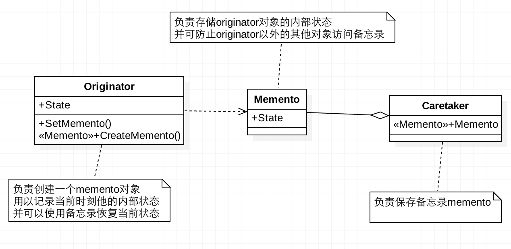

[TOC]

# 备忘录模式

备忘录模式（Memento），又叫快照模式。在不破坏封装性的前提下，捕获一个对象的内部状态，并在该对象之外保存这个状态。
主要用于捕获一个对象的内部状态，以便在将来的某个时候恢复此状态。

**作用**

- 提供了一种可以恢复状态的机制。当用户需要时能够比较方便地将数据恢复到某个历史的状态。
- 实现了内部状态的封装。除了创建它的发起人角色之外，其他对象都不能够访问这些状态信息。
- 简化了发起人角色。发起人角色不需要管理和保存其内部状态的各个备份，所有状态信息都保存在备忘录中，并由管理者进行管理，这符合单一职责原则。

**缺点**

资源消耗大。如果要保存的内部状态信息过多或者特别频繁，将会占用比较大的内存资源。

**适用场景**

- 需要保存与恢复数据的场景，如玩游戏的存档功能。
- 需要提供一个可回滚操作的场景，如 Word、记事本等软件在编辑时按 Ctrl+Z 组合键，还有数据库中事务操作。

## 类图



- 发起人角色(Originator)：负责创建一个备忘录，记录自身需要保存的状态，而且需要具备状态的回滚功能。
- 备忘录角色(Memento)：用于存储 Originator 角色的内部状态，且可以防止 Originator 以外的对象进行访问。
- 备忘录管理员角色(Caretaker)：负责对备忘录进行管理，提供保存与获取备忘录的功能。且其本身不能对备忘录的内容进行访问与修改。

## 代码表达

```java
// 发起人角色(Originator)
public class Originator {
    private String state;

    public String getState() {
        return state;
    }

    public void setState(String state) {
        this.state = state;
    }

    // 保存状态
    public Memento saveStateMemento() {
        return new Memento(state);
    }

    // 恢复状态
    public void getStateFromMemento(Memento memento) {
        this.state = memento.getState();
    }
}
```

```java
// 备忘录角色(Memento)
public class Memento {
    private String state;

    public Memento(String state) {
        this.state = state;
    }

    public String getState() {
        return state;
    }
}
```

```java
// 备忘录管理员角色(Caretaker)
public class Caretaker {
    private List<Memento> mementoList = new ArrayList<>();

    public void add(Memento memento) {
        mementoList.add(memento);
    }

    public Memento get(int index) {
        if (index >= 0 && index < mementoList.size()) {
            return mementoList.get(index);
        }
        return null;
    }
}
```

客户端调用

```java
Originator originator = new Originator();
Caretaker caretaker = new Caretaker();
// 保存多个状态
originator.setState("state1:100");
caretaker.add(originator.saveStateMemento());
originator.setState("state2:200");
caretaker.add(originator.saveStateMemento());
originator.setState("state3:300");
caretaker.add(originator.saveStateMemento());
System.out.println(originator.getState());
// 恢复状态
originator.getStateFromMemento(caretaker.get(0));
System.out.println(originator.getState());
originator.getStateFromMemento(caretaker.get(1));
System.out.println(originator.getState());
originator.getStateFromMemento(caretaker.get(2));
System.out.println(originator.getState());
```
