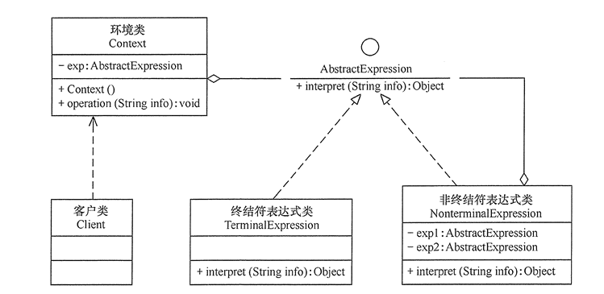

[TOC]

# 解释器模式

解释器模式（Interpreter Pattern），是指给定一个语言(表达式)，定义它的文法的一种表示，并定义一个解释器，使用该解释器来解释语言中的句子(表达式)

**作用**

- 易于实现语法，一条语法用一个解释器对象解释执行
- 易于扩展新语法，只需创建对应解释器，抽象语法树时使用即可

**缺点**

- 可使用场景少，复用性不高，除了发明新的编程语言或对某些新硬件进行解释外，很少用，特定数据结构，扩展性也低
- 维护成本高，每种规则至少要定义一个解释类，语法规则越多，类越难管理和维护
- 执行效率低，递归调用方法，解释句子语法复杂时，会执行大量循环语句

**适用场景**

- 可以将一个需要解释执行的语言中的句子表示为一个抽象语法树
- 一些重复出现的问题可以用一种简单的语言来表达
- 一个简单语法需要解释的场景
- 典型场景：编译器、规则引擎、正则表达式、运算表达式

## 类图



- 抽象表达式（Abstract Expression）：定义解释器的接口，约定解释器的解释操作，主要包含解释方法 interpret()。
- 终结符表达式（Terminal Expression）：是抽象表达式的子类，实现文法中元素相关联的解释操作，文法中的每一个元素都有一个具体终结表达式与之相对应。
- 非终结符表达式（Nonterminal Expression）：也是抽象表达式的子类，实现文法中规则关联的解释操作，文法中的每条规则对应于一个非终结符表达式，一般是文法中的运算符或其他关键字。
- 上下文（Context）：通常包含各个解释器需要的数据或是公共的功能，一般用来传递被所有解释器共享的数据，后面的解释器可以从这里获取这些值。

## 代码表达

```java
// 抽象表达式（Abstract Expression）
public abstract class Expression {
    public abstract int interpreter(Context context);
}
```

```java
// 终结符表达式（Terminal Expression）
public class VarExpression extends Expression {
    private String key;

    public VarExpression(String key) {
        this.key = key;
    }

    @Override
    public int interpreter(Context context) {
        return context.getValue(key);
    }
}
```

```java
// 非终结符表达式（Nonterminal Expression）
public class SymbolExpression extends Expression {
    protected Expression left;
    protected Expression right;

    public SymbolExpression(Expression left, Expression right) {
        this.left = left;
        this.right = right;
    }

    // SymbolExpression 的功能由具体子类实现，此处默认空实现
    @Override
    public int interpreter(Context context) {
        return 0;
    }
}

public class AddExpression extends SymbolExpression {
    public AddExpression(Expression left, Expression right) {
        super(left, right);
    }

    // 加法解释器
    @Override
    public int interpreter(Context context) {
        return super.left.interpreter(context) + super.right.interpreter(context);
    }
}

public class SubExpression extends SymbolExpression {
    public SubExpression(Expression left, Expression right) {
        super(left, right);
    }

    // 减法解释器
    @Override
    public int interpreter(Context context) {
        return super.left.interpreter(context) - super.right.interpreter(context);
    }
}
```

```java
// 上下文（Context）
public class Context {
    // HashMap 中包含各个解释器需要的数据
    private HashMap<String, Integer> var;

    public Context() {
        this.var = new HashMap<>();
    }

    public void addEntry(String key, int value) {
        var.put(key, value);
    }

    public int getValue(String key) {
        return var.get(key);
    }
}
```

```java
// 具体逻辑实现类，供客户端调用
public class Calculator {
    // 实现加减表达式具体逻辑
    public Calculator(String exp, Context context) {
        Stack<Expression> stack = new Stack<>();
        char[] charArray = exp.toCharArray();
        Expression left = null;
        Expression right = null;
        for (int i = 0; i < charArray.length; i++) {
            switch (charArray[i]) {
                case '+':
                    left = stack.pop();
                    i++;
                    right = new VarExpression(String.valueOf(charArray[i]));
                    stack.push(new AddExpression(left, right));
                    break;
                case '-':
                    left = stack.pop();
                    i++;
                    right = new VarExpression(String.valueOf(charArray[i]));
                    stack.push(new SubExpression(left, right));
                    break;
                default:
                    stack.push(new VarExpression(String.valueOf(charArray[i])));
                    break;
            }
        }
        int result = stack.pop().interpreter(context);
        System.out.println(result);
    }
}
```

客户端调用

```java
String exp = "a+b-c";
Context context = new Context();
context.addEntry("a", 30);
context.addEntry("b", 40);
context.addEntry("c", 50);
new Calculator(exp, context);
```
