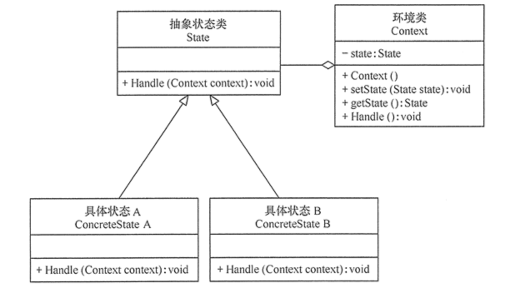

[TOC]

# 状态模式

状态模式（State）允许一个对象在其内部状态改变时改变它的行为。对象看起来似乎修改了它的类。
对有状态的对象，把复杂的“判断逻辑”提取到不同的状态对象中，允许状态对象在其内部状态发生改变时改变其行为。

**作用**

- 状态模式将与特定状态相关的行为局部化到一个状态中，并且将不同状态的行为分割开来，满足“单一职责原则”。
- 减少对象间的相互依赖。将不同的状态引入独立的对象中会使得状态转换变得更加明确，且减少对象间的相互依赖。
- 有利于程序的扩展。通过定义新的子类很容易地增加新的状态和转换。

**缺点**

- 状态模式的使用必然会增加系统的类与对象的个数。
- 状态模式的结构与实现都较为复杂，如果使用不当会导致程序结构和代码的混乱。

**适用场景**

- 一个对象，存在多个状态，状态可以相互转换；
- 不同状态下，行为不同；

## 类图



- 上下文（Context）角色：它定义了客户感兴趣的接口，维护一个当前状态，并将与状态相关的操作委托给当前状态对象来处理。
- 抽象状态（State）角色：定义一个接口，用以封装环境对象中的特定状态所对应的行为。
- 具体状态（Concrete State）角色：实现抽象状态所对应的行为。

## 代码表达

```java
// 抽象状态（State）角色
public abstract class State {
    // 扣除积分
    public abstract void deductMoney();

    // 抽中奖品
    public abstract boolean raffle();

    // 分发奖品
    public abstract void dispensePrize();
}
```

```java
// 具体状态（Concrete State）角色
public class NoRaffleState extends State {
    private Activity activity;

    public NoRaffleState(Activity activity) {
        this.activity = activity;
    }

    @Override
    public void deductMoney() {
        System.out.println("deductMoney succ");
        activity.setCurrentState(activity.getCanRaffleState());
    }

    @Override
    public boolean raffle() {
        System.out.println("ERROR:NoRaffleState not raffle");
        return false;
    }

    @Override
    public void dispensePrize() {
        System.out.println("ERROR:NoRaffleState not dispensePrize");
    }
}

public class CanRaffleState extends State {
    private Activity activity;

    public CanRaffleState(Activity activity) {
        this.activity = activity;
    }

    @Override
    public void deductMoney() {
        System.out.println("ERROR:CanRaffleState not deductMoney");
    }

    @Override
    public boolean raffle() {
        int num = new Random().nextInt(2);
        if (num == 0) {
            System.out.println("raffle succ");
            activity.setCurrentState(activity.getDispenseState());
            return true;
        } else {
            System.out.println("raffle fail");
            activity.setCurrentState(activity.getNoRaffleState());
            return false;
        }
    }

    @Override
    public void dispensePrize() {
        System.out.println("ERROR:CanRaffleState not dispensePrize");
    }
}

public class DispenseState extends State {
    private Activity activity;

    public DispenseState(Activity activity) {
        this.activity = activity;
    }

    @Override
    public void deductMoney() {
        System.out.println("ERROR:DispenseState not deductMoney");
    }

    @Override
    public boolean raffle() {
        System.out.println("ERROR:DispenseState not raffle");
        return false;
    }

    @Override
    public void dispensePrize() {
        if (activity.getCount() > 0) {
            System.out.println("dispensePrize start");
            activity.setCurrentState(activity.getNoRaffleState());
        } else {
            System.out.println("dispensePrize finish");
            activity.setCurrentState(activity.getDispenseOutState());
        }
    }
}

public class DispenseOutState extends State {
    private Activity activity;

    public DispenseOutState(Activity activity) {
        this.activity = activity;
    }

    @Override
    public void deductMoney() {
        System.out.println("ERROR:DispenseOutState not deductMoney");
    }

    @Override
    public boolean raffle() {
        System.out.println("ERROR:DispenseOutState not raffle");
        return false;
    }

    @Override
    public void dispensePrize() {
        System.out.println("ERROR:DispenseOutState not dispensePrize");
    }
}
```

```java
// 上下文（Context）角色
public class Activity {
    // 当前状态
    private State currentState;
    // 其余所有可能的状态
    private State noRaffleState = new NoRaffleState(this);
    private State canRaffleState = new CanRaffleState(this);
    private State dispenseState = new DispenseState(this);
    private State dispenseOutState = new DispenseOutState(this);

    int count = 0;

    public Activity() {
        currentState = new NoRaffleState(this);
        count = 1;
    }

    public void deductMoney() {
        currentState.deductMoney();
    }

    public void raffle() {
        if (currentState.raffle()) {
            currentState.dispensePrize();
        }
    }

    public void setCurrentState(State currentState) {
        this.currentState = currentState;
    }

    public int getCount() {
        int curCount = count;
        count--;
        return curCount;
    }

    public State getNoRaffleState() {
        return noRaffleState;
    }

    public State getCanRaffleState() {
        return canRaffleState;
    }

    public State getDispenseState() {
        return dispenseState;
    }

    public State getDispenseOutState() {
        return dispenseOutState;
    }
}
```

客户端调用

```java
Activity activity = new Activity();
for (int i = 0; i < 5; i++) {
    System.out.println("Activity times:" + i);
    activity.deductMoney();
    activity.raffle();
}
```
