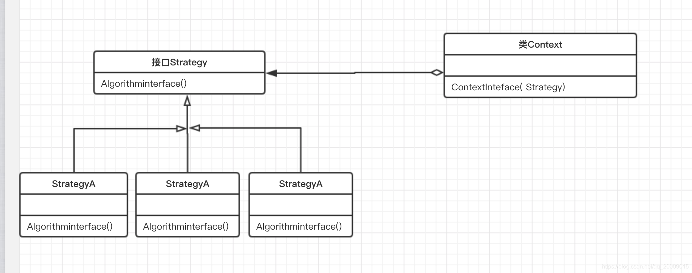

[TOC]

# 策略模式

策略模式（Strategy Pattern），定义一系列算法，并将每个算法封装起来，使它们可以相互替换，不同的策略使用不同的算法，且算法的变化不会影响使用算法的客户端。

**作用**

- 算法可以自由切换
- 避免使用多重条件判断（如果不用策略模式可能会使用多重条件语句，不利于维护）
- 扩展性良好，增加一个策略只需实现接口即可

**缺点**

- 策略类数量会增多，每个策略都是一个类，复用的可能性很小
- 所有的策略类都需要对外暴露

**适用场景**

- 多个类只有算法或行为上稍有不同的场景
- 算法需要自由切换的场景
- 需要屏蔽算法规则的场景

## 类图



- 上下文（Context）角色：起承上启下封装作用，屏蔽高层模块对策略、算法的直接访问，封装可能存在的变化。
- 抽象策略（Strategy）角色：策略、算法家族的抽象，通常为接口，定义每个策略或算法必须具有的方法和属性。
- 具体策略（ConcreteStrategy）角色：实现抽象策略中的操作，该类含有具体的算法。

## 代码表达

```java
// 抽象策略（Strategy）角色
public interface FlyBehavior {
    void fly();
}

public interface QuackBehavior {
    void quack();
}
```

```java
// 具体策略（ConcreteStrategy）角色
public class GoodFlyBehavior implements FlyBehavior {
    @Override
    public void fly() {
        System.out.println("GoodFly");
    }
}

public class NoFlyBehavior implements FlyBehavior {
    @Override
    public void fly() {
        System.out.println("NoFly");
    }
}

public class BadFlyBehavior implements FlyBehavior {
    @Override
    public void fly() {
        System.out.println("BadFly");
    }
}

public class HighQuackBehavior implements QuackBehavior {
    @Override
    public void quack() {
        System.out.println("HighQuack");
    }
}

public class LowQuackBehavior implements QuackBehavior {
    @Override
    public void quack() {
        System.out.println("LowQuack");
    }
}
```

```java
// 上下文（Context）角色
public abstract class Duck {
    // 聚合所有的策略类
    protected FlyBehavior flyBehavior;
    protected QuackBehavior quackBehavior;

    public void setFlyBehavior(FlyBehavior flyBehavior) {
        this.flyBehavior = flyBehavior;
    }

    public void setQuackBehavior(QuackBehavior quackBehavior) {
        this.quackBehavior = quackBehavior;
    }

    public abstract void display();

    public void swim() {
        System.out.println("Duck swim");
    }

    public void fly() {
        if (flyBehavior != null) {
            flyBehavior.fly();
        }
    }

    public void quack() {
        if (quackBehavior != null) {
            quackBehavior.quack();
        }
    }
}

// 上下文（Context）角色具体实现类
public class WildDuck extends Duck {
    public WildDuck() {
        flyBehavior = new GoodFlyBehavior();
        quackBehavior = new HighQuackBehavior();
    }

    @Override
    public void display() {
        System.out.println("WildDuck display");
    }
}

public class PekingDuck extends Duck {
    public PekingDuck() {
        flyBehavior = new BadFlyBehavior();
        quackBehavior = new LowQuackBehavior();
    }

    @Override
    public void display() {
        System.out.println("PekingDuck display");
    }
}

public class ToyDuck extends Duck {

    public ToyDuck() {
        flyBehavior = new NoFlyBehavior();
    }

    @Override
    public void swim() {
        System.out.println("ToyDuck can not swim");
    }

    @Override
    public void quack() {
        System.out.println("ToyDuck can not quack");
    }

    @Override
    public void display() {
        System.out.println("ToyDuck display");
    }
}
```

客户端调用

```java
WildDuck wildDuck = new WildDuck();
wildDuck.display();
wildDuck.fly();
wildDuck.quack();
PekingDuck pekingDuck = new PekingDuck();
pekingDuck.display();
pekingDuck.fly();
pekingDuck.quack();
ToyDuck toyDuck = new ToyDuck();
toyDuck.display();
toyDuck.fly();
toyDuck.quack();
// 动态改变对象的行为策略
pekingDuck.setFlyBehavior(new GoodFlyBehavior());
pekingDuck.setQuackBehavior(new HighQuackBehavior());
pekingDuck.display();
pekingDuck.fly();
pekingDuck.quack();
```
