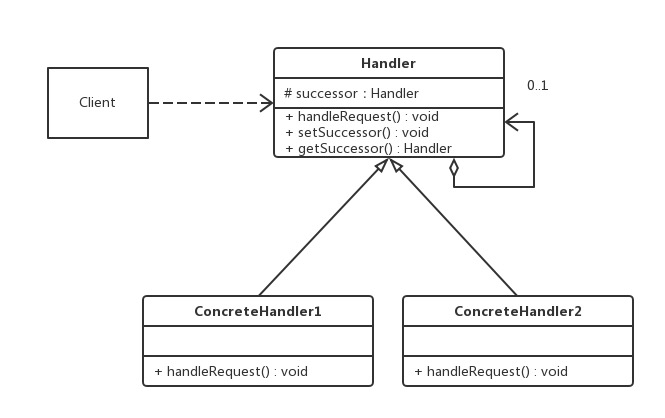

[TOC]

# 责任链模式

责任链模式（Chain of Responsibility），又称职责链模式，使多个对象都有机会处理请求，从而避免请求的发送者和接收者之间的耦合关系。将这些对象连成一条链，并沿着这条链传递该请求，直到有一个对象处理它为止。

**作用**

- 降低了对象之间的耦合度。该模式使得一个对象无须知道到底是哪一个对象处理其请求以及链的结构，发送者和接收者也无须拥有对方的明确信息。
- 增强了系统的可扩展性。可以根据需要增加新的请求处理类，满足开闭原则。
- 增强了给对象指派职责的灵活性。当工作流程发生变化，可以动态地改变链内的成员或者调动它们的次序，也可动态地新增或者删除责任。
- 责任链简化了对象之间的连接。每个对象只需保持一个指向其后继者的引用，不需保持其他所有处理者的引用，这避免了使用众多的 if 判断。
- 责任分担。每个类只需要处理自己该处理的工作，不该处理的传递给下一个对象完成，明确各类的责任范围，符合类的单一职责原则。

**缺点**

- 不能保证每个请求一定被处理。由于一个请求没有明确的接收者，所以不能保证它一定会被处理，该请求可能一直传到链的末端都得不到处理。
- 对比较长的职责链，请求的处理可能涉及多个处理对象，创建的类增加，系统性能将受到一定影响。
- 职责链建立的合理性要靠客户端来保证，增加了客户端的复杂性，可能会由于职责链的错误设置而导致系统出错，如可能会造成循环调用。

**适用场景**

- 一个请求需要被多个对象中的某一个处理，但是具体是哪个对象处理必须在运行时根据条件决定。
- 典型场景：多级请求，流程审批，拦截器

## 类图



- 抽象处理者（Handler）角色：定义一个处理请求的接口，包含抽象处理方法和一个后继连接。
- 具体处理者（Concrete Handler）角色：实现抽象处理者的处理方法，判断能否处理本次请求，如果可以处理请求则处理，否则将该请求转给它的后继者。
- 客户类（Client）角色：创建处理链，并向链头的具体处理者对象提交请求，它不关心处理细节和请求的传递过程。

## 代码表达

```java
// 数据对象，不在类图中体现
public class PurchaseRequest {
    private int price = 0;

    public PurchaseRequest(int price) {
        this.price = price;
    }

    public int getPrice() {
        return price;
    }
}
```

```java
// 抽象处理者（Handler）角色
public abstract class Approver {
    // 下一个处理者
    protected Approver nextApprover;

    public void setNextApprover(Approver approver) {
        this.nextApprover = approver;
    }

    public abstract void processRequest(PurchaseRequest request);
}
```

```java
// 具体处理者（Concrete Handler）角色
public class DepartmentApprover extends Approver {
    @Override
    public void processRequest(PurchaseRequest request) {
        if (request.getPrice() <= 1000) {
            System.out.println("DepartmentApprover processRequest");
        } else {
            nextApprover.processRequest(request);
        }
    }
}

public class CollegeApprover extends Approver {
    @Override
    public void processRequest(PurchaseRequest request) {
        if (request.getPrice() <= 2000) {
            System.out.println("CollegeApprover processRequest");
        } else {
            nextApprover.processRequest(request);
        }
    }
}

public class ViceSchoolMasterApprover extends Approver {
    @Override
    public void processRequest(PurchaseRequest request) {
        if (request.getPrice() <= 3000) {
            System.out.println("ViceSchoolMasterApprover processRequest");
        } else {
            nextApprover.processRequest(request);
        }
    }
}

public class SchoolMasterApprover extends Approver {
    @Override
    public void processRequest(PurchaseRequest request) {
        System.out.println("SchoolMasterApprover processRequest");
    }
}
```

```java
// 客户类（Client）角色
public class Client {
    public static void main(String[] args) {
        // 数据对象
        PurchaseRequest request = new PurchaseRequest(1500);
        // 各个审批角色
        DepartmentApprover department = new DepartmentApprover();
        CollegeApprover college = new CollegeApprover();
        ViceSchoolMasterApprover viceSchoolMaster = new ViceSchoolMasterApprover();
        SchoolMasterApprover schoolMaster = new SchoolMasterApprover();
        // 设置各审批角色的审批链
        department.setNextApprover(college);
        college.setNextApprover(viceSchoolMaster);
        viceSchoolMaster.setNextApprover(schoolMaster);
        // 开始处理请求
        department.processRequest(request);
    }
}
```
